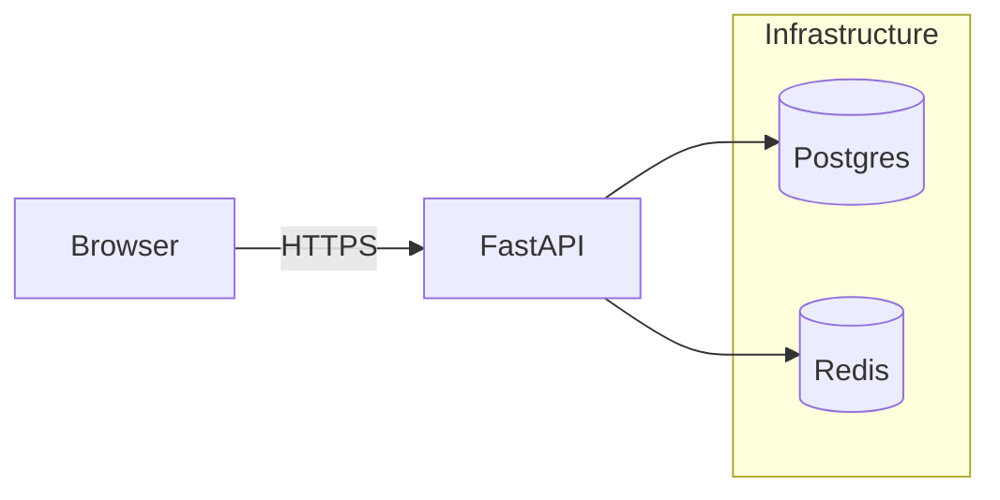

# backend-foundry

   

> A minimal, opinionated backend reference for learning scalable backend systems, auth flows, and containerized infrastructure.

## Tech Stack

- **Framework:** FastAPI
- **Web Server:** Uvicorn (ASGI)
- **Database:** PostgreSQL (async via asyncpg / SQLAlchemy)
- **Cache / Broker:** Redis
- **Auth:** JWT access tokens + refresh token rotation
- **Containerization:** Docker Compose

## Architecture Overview

Simple multi-service architecture: API service, Postgres, Redis, optional admin worker.



## Features

- JWT authentication (access + refresh)
- Refresh token rotation and invalidation on logout
- Redis-backed rate limiting per IP / user
- Async PostgreSQL connection pooling
- Dockerized multi-service setup with Compose

## Folder Structure

```
auth_backend/
  ├─ main.py            # app entrypoint
  ├─ core/
  │   └─ config.py
  ├─ database/
  │   ├─ db.py
  │   ├─ sql.py
  │   └─ reddis_core.py
  ├─ routes/
  │   ├─ auth.py
  │   └─ users.py
  ├─ schemas/
  │   ├─ auth.py
  │   └─ user.py
  └─ services/
      ├─ auth.py
      ├─ security.py
      └─ rate_limit.py

auth_backend_frontend/
  ├─ index.html
  └─ script.js

Dockerfile
docker-compose.yml
requirements.txt
```

## Docker setup

Start the full stack with Docker Compose (builds images when needed):

```bash
docker-compose up --build
```

Run in background:

```bash
docker-compose up -d --build
```

To view logs:

```bash
docker-compose logs -f api
```

To stop and remove containers:

```bash
docker-compose down --volumes
```

## Environment variables (.env example)

Create a `.env` file at the project root with values for your environment:

```env
# App
APP_HOST=0.0.0.0
APP_PORT=8000
DEBUG=false

# Database
POSTGRES_USER=postgres
POSTGRES_PASSWORD=postgres
POSTGRES_DB=backend
POSTGRES_HOST=db
POSTGRES_PORT=5432
DATABASE_URL=postgresql+asyncpg://${POSTGRES_USER}:${POSTGRES_PASSWORD}@${POSTGRES_HOST}:${POSTGRES_PORT}/${POSTGRES_DB}

# Redis
REDIS_URL=redis://redis:6379/0

# Security
JWT_SECRET=replace-with-secure-random-string
ACCESS_TOKEN_EXPIRES_MIN=15
REFRESH_TOKEN_EXPIRES_DAYS=30

# Rate limiting (example)
RATE_LIMIT_REQUESTS=100
RATE_LIMIT_WINDOW_SECONDS=60
```

## API Endpoints

| Endpoint | Method | Auth | Description |
|---|---:|---:|---|
| `/api/v1/auth/register` | POST | No | Create new user (email/password) |
| `/api/v1/auth/login` | POST | No | Authenticate — returns access + refresh tokens |
| `/api/v1/auth/refresh` | POST | Refresh token | Rotate refresh token, returns new access + refresh |
| `/api/v1/auth/logout` | POST | Refresh token | Invalidate refresh token (logout) |
| `/api/v1/users/me` | GET | Access token | Current user profile |

Example request/response (login):

```json
POST /api/v1/auth/login
{
  "email": "you@example.com",
  "password": "secret"
}

200 OK
{
  "access_token": "ey...",
  "refresh_token": "ey...",
  "token_type": "bearer"
}
```

## Screenshots

Add UI or API screenshots here. Example placeholders:

- ./screenshots/login.png
- ./screenshots/requests.png

## Learning outcomes / Concepts learned

- Building async FastAPI apps and connection pooling
- Implementing secure JWT flows with refresh token rotation
- Designing token invalidation and logout flows
- Using Redis for rate limiting and short-lived state
- Containerizing a multi-service backend with Docker Compose
- Local development flows and environment configuration

## Future improvements

- Add automated tests (unit + integration) and CI pipeline
- Support role-based access control and scopes
- Add background workers for async tasks (Celery / RQ)
- Harden security (key rotation, refresh token fingerprinting)
- Observability: logging, distributed tracing, metrics

---

If you'd like, I can also:

- add CI workflow, or
- generate a README image banner or real screenshots

File: [README.md](README.md)
